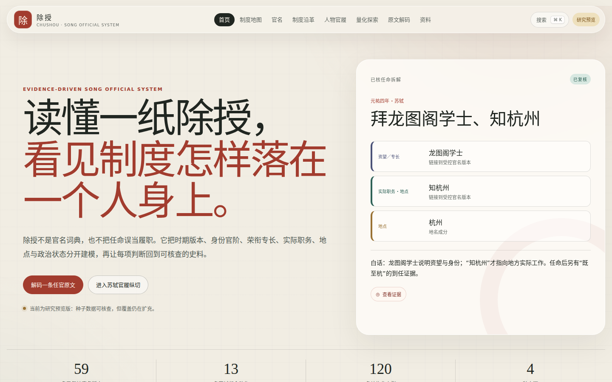

# 除授 Chushou

一套从可追溯证据出发、用于理解宋代官制与人物官履的静态优先研究工具。

“除授”不把官衔压成一条高低刻度。系统分别保存身份／官阶、荣衔与专长、实际职务、地点和政治状态，并区分任命动作与实际任事。每项可发布主张都能展开到短引文、版本和来源定位。

GitHub Pages 目标地址：[在线研究预览](https://chen-qingxiang.github.io/chushou/)（合并到 `main` 后由 workflow 发布；2026-07-13 核验时尚未上线）。



当前是 `0.3.0-research.1` 研究预览版：59 个时期化官名概念、3 个局部品秩方案、13 条苏轼任命动作、3 条反例人物任命、120 条结构化主张和 139 条证据关联；《宋史》卷 338 的 38 条任官／身份语句已穷尽枚举为 coverage ledger。数量是覆盖进度，不代表宋代官制或任何人物官履已经完整。

## 目前可用

- 引导首页与三层官衔解释；
- 简繁体、别名、拼音和轻量容错全局搜索；
- 时期化官名列表、详情和证据抽屉；
- 制度地图、元丰改制对照和研究缺口提示；
- 多品秩方案、方案内局部序列，以及带置信度／争议说明的跨方案换官边；
- 苏轼官履时间线、地点序列、任命原文 span 拆解与实际任事分离；
- 王安石、司马光、章惇各一条可检索、可下钻的反例任命切片；
- 动作分布和明确评分规则下的量化探索；
- 最长匹配、未知片段保留和时期镜头驱动的原文解码器；
- 任命前后、两个官名按时期、四名人物制度位置的可深链接比较；
- 来源浏览、学习路径、可深链接的真实任命路径回放，以及只检查时期／语义的官衔构造实验；
- 带版本、schema、许可、引用和 SHA-256 manifest 的 release JSON、官名／任命／证据／覆盖 CSV 与机器可读数据字典；
- 随 release 发布的机器可读 coverage matrices，以及自动生成的分母、缺口和阻塞报告；
- React Router 深链接、应用内 404、移动端布局和 GitHub Pages base path。

## 本地运行

需要 Node.js 24 和 npm。

```bash
npm ci
npm run data:validate
npm run dev
```

开发服务器会输出本地地址。生产预览：

```bash
npm run build
npm run preview --workspace @chushou/web
```

## 质量门禁

```bash
npm run format:check
npm run lint
npm run typecheck
npm run data:validate
npm run schema:check
npm test
npm run build
npm run quality:budget
npm run test:e2e
npm run quality:lighthouse
```

`npm run ci` 串联除浏览器测试外的全部门禁，包括已提交 JSON Schema 的新鲜度和生产产物体积预算。GitHub Actions 还会在 Chromium 中执行 13 条关键与无障碍旅程，再把通过验证的同一份 `dist/` 发布到 Pages。`quality:lighthouse` 使用已安装的 Playwright Chromium 对三个主要路由复测移动模拟基线。终检范围与基线见[性能与无障碍报告](docs/reports/PERFORMANCE_ACCESSIBILITY.md)。

## 仓库结构

```text
apps/web/             React + TypeScript + Vite 应用
packages/schema/      Zod schema、受控词表、稳定 ID 与跨表校验
packages/domain/      搜索、原文解码与站点投影
tools/ingest/         curated loader、生成器、报告与测试
data/curated/         人工审阅的唯一权威编辑源
data/generated/       确定性生成的站点投影、release、CSV、manifest 与数据字典
docs/research/        来源策略、引用规范、研究日志与争议记录
docs/reports/         自动生成的覆盖和数据质量报告
docs/goal/            迁移审计、决策、总计划与持续进展
tests/e2e/            Playwright 关键用户旅程
```

## 数据与证据模型

核心层次是：

```text
Source → Edition → Locator → Passage
                         ↘ EvidenceLink → Assertion

TitleConcept → TitleUsageVersion(time)
Institution  → InstitutionVersion(time) → typed relation
RankScheme → Rank(sequence) → RankCrosswalk(confidence / dispute)
Person → AppointmentAction → ordered components
                           ↘ ServiceEpisode
```

- 史料原文不与现代解释混写；
- 官名含义、机构和关系按有效期建版本；
- 品秩序号只在所属方案内有意义；跨方案换算必须有方向、依据、置信度和争议状态；
- `除`、`授`、`迁`、`责授`等动作不自动证明到任；
- reviewed／accepted 主张没有支持性 passage 时构建失败；
- 断裂引用、重复 ID、非法 source span、重叠同义版本、冲突别名和生产占位文字都会触发门禁。

录入前请阅读[贡献指南](CONTRIBUTING.md)、[数据录入指南](docs/research/DATA_ENTRY_GUIDE.md)、[引用规范](docs/research/CITATION_GUIDE.md)和[来源策略](docs/research/SOURCE_STRATEGY.md)。

## 研究边界

当前已穷尽枚举《宋史》卷 338 数字转录中的 38 条任官／制度身份语句：13 条链接到数据库记录且仍为 partial，25 条明确为 gap。这个分母只对该传记锚点成立；尚未取得可合法全文核对的孔凡礼《苏轼年谱》，权威年谱矩阵因此保持 blocked，项目不会声称“完整苏轼官履”。正式研究引用仍应回查可靠点校本。反例人物仅用于检验通用模型，不代表完整生涯；品秩只发布卷 169 可直接核对的局部序列，南宋时段仍在扩充。

路径实验室同样遵守这一边界：它可以回放人物当前 release 中的任命顺序并检查到任、处分、未解析成分和时间精度，但不会把顺序伪装成因果、概率或人人适用的晋升树。进士入仕、磨勘、荐举、丁忧、回避、台谏与地方监察等通用规则在证据和反例进入 schema 前保持锁定。

自动生成的最新状态见 [数据质量报告](docs/reports/data-quality.md)与[覆盖报告](docs/reports/coverage.md)。

## 引用与许可

数据集仍处研究预览期，引用时应同时给出 release 版本、具体 assertion／passage ID 和底层来源定位。项目代码采用 [MIT](LICENSE)；项目原创整理数据采用 [CC BY 4.0](LICENSE-DATA.md)，并提供机器可读的 [`CITATION.cff`](CITATION.cff)。第三方短引文不因进入数据集而改变权利状态，各数字版本和原始材料的许可／权利说明按 edition 单独记录。

本轮实现与诚实边界汇总于[最终交付说明](docs/goal/FINAL_DELIVERY.md)。
